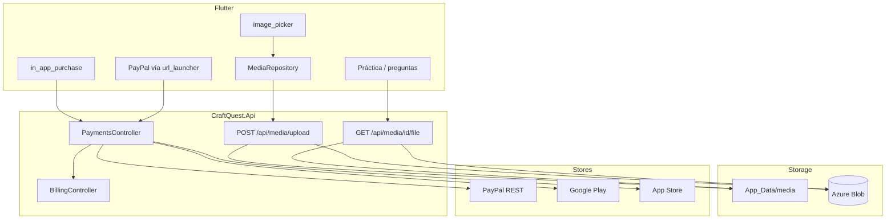
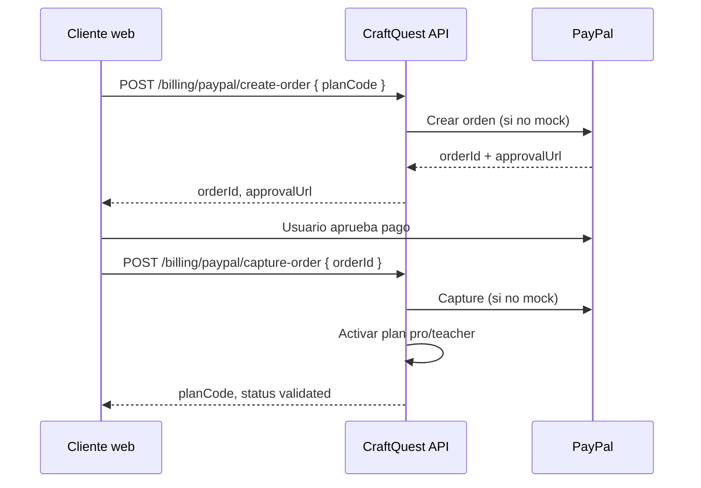

# CraftQuest 4.0 — Configuración de media, imágenes y pagos

Guía operativa para **almacenamiento de imágenes**, **subida desde Flutter** y **pagos** (PayPal en web, Google Play / App Store en móvil). No se usa Stripe.

---

## Índice

1. [Resumen de arquitectura](#1-resumen-de-arquitectura)
2. [Media: almacenamiento local y Azure Blob](#2-media-almacenamiento-local-y-azure-blob)
3. [Subida de imágenes (API y Flutter)](#3-subida-de-imágenes-api-y-flutter)
4. [Pagos: planes y endpoints](#4-pagos-planes-y-endpoints)
5. [PayPal (web)](#5-paypal-web)
6. [Compras in-app (Google Play / App Store)](#6-compras-in-app-google-play--app-store)
7. [Modo mock (desarrollo)](#7-modo-mock-desarrollo)
8. [Variables de configuración](#8-variables-de-configuración)
9. [Pruebas manuales](#9-pruebas-manuales)
10. [Producción: checklist](#10-producción-checklist)

---

## 1. Resumen de arquitectura



| Canal | Uso | Proveedor |
|-------|-----|-----------|
| Web / escritorio | Suscripción de pago | PayPal Checkout |
| Android / iOS | Suscripción de pago | Google Play / App Store (IAP) |
| Desarrollo local | Sin credenciales externas | `UseMockPayments: true` |

---

## 2. Media: almacenamiento local y Azure Blob

### Proveedores

| `Media:StorageProvider` | Descripción |
|-------------------------|-------------|
| `local` (por defecto) | Archivos en `App_Data/media` bajo la raíz de la API |
| `azure` | Archivos en un contenedor de Azure Blob Storage |

La entidad `content.MediaAssets` guarda metadatos (`StorageProvider`, `BlobPath`, hash SHA-256, etc.). El cliente **siempre** consume imágenes por URL relativa `/api/media/{id}/file`; la API lee del proveedor configurado en el momento de la subida.

### Configuración local

En `src/CraftQuest.Api/appsettings.json` (o `appsettings.Development.json`):

```json
"Media": {
  "StorageProvider": "local",
  "LocalRootPath": "App_Data/media",
  "PublicBasePath": "/api/media",
  "MaxUploadBytes": 5242880,
  "AllowedImageExtensions": [".jpg", ".jpeg", ".png", ".webp", ".gif"]
}
```

- Carpeta ignorada por git: `src/**/App_Data/media/` (ver `.gitignore`).
- Tamaño máximo por defecto: **5 MB**.

### Configuración Azure Blob

1. Crear una **cuenta de almacenamiento** en Azure.
2. Crear un contenedor privado, por ejemplo `craftquest-media`.
3. Copiar la **cadena de conexión** (Claves de acceso → Connection string).
4. Configurar la API:

```json
"Media": {
  "StorageProvider": "azure",
  "PublicBasePath": "/api/media",
  "MaxUploadBytes": 5242880,
  "Azure": {
    "ConnectionString": "DefaultEndpointsProtocol=https;AccountName=...;AccountKey=...;EndpointSuffix=core.windows.net",
    "ContainerName": "craftquest-media"
  }
}
```

**Recomendación producción:** guardar la connection string en **Azure Key Vault** o variables de entorno (`Media__Azure__ConnectionString`), no en el repositorio.

### Migración local → Azure

Los assets ya subidos con `StorageProvider = local` siguen leyéndose desde disco. Solo los **nuevos** uploads usan Azure si cambias `StorageProvider`. Para migrar histórico habría que copiar blobs y actualizar filas en `content.MediaAssets` (script aparte).

---

## 3. Subida de imágenes (API y Flutter)

### API

| Método | Ruta | Auth | Descripción |
|--------|------|------|-------------|
| `POST` | `/api/media/upload` | JWT | `multipart/form-data`: campo `file`, opcional `altText` |
| `GET` | `/api/media/{mediaAssetId}/file` | Público | Devuelve el binario de la imagen |

**Respuesta de upload (201):**

```json
{
  "mediaAssetId": "3fa85f64-5717-4562-b3fc-2c963f66afa6",
  "originalFileName": "foto.png",
  "contentType": "image/png",
  "url": "/api/media/3fa85f64-5717-4562-b3fc-2c963f66afa6/file",
  "fileSizeBytes": 102400
}
```

### Uso en preguntas

Al crear una pregunta (`POST /api/quizzes/{quizId}/questions`), cada opción puede incluir:

```json
{
  "clientKey": "A",
  "text": "París",
  "mediaAssetId": "3fa85f64-5717-4562-b3fc-2c963f66afa6",
  "defaultSortOrder": 0
}
```

En **práctica**, `PracticeAnswerOptionDto` expone `mediaUrl` (misma ruta `/api/media/.../file`).

### Flutter

| Componente | Ubicación |
|------------|-----------|
| Repositorio | `lib/features/media/data/media_repository.dart` |
| Widget | `lib/core/widgets/option_image_picker.dart` |
| Pantalla | `lib/features/quizzes/presentation/add_question_page.dart` |

Flujo en la app:

1. Añadir pregunta → opción A/B/C/D → **Adjuntar imagen**.
2. `image_picker` selecciona de galería → `MediaRepository.uploadImage`.
3. Se guarda `mediaAssetId` en el payload de la opción.
4. En sesión de práctica, la URL se resuelve con `API_BASE_URL + mediaUrl`.

**Emulador Android:**

```powershell
flutter run --dart-define=API_BASE_URL=https://10.0.2.2:7080
```

---

## 4. Pagos: planes y endpoints

### Planes en base de datos (`billing.Plans`)

| Código | Nombre | Precio mensual (USD) | Notas |
|--------|--------|----------------------|--------|
| `free` | Free | — | Límites: 2 cuestionarios, 50 preguntas/quiz, 2 códigos/mes |
| `pro` | Pro | 4.99 | Comprable |
| `teacher` | Teacher | 9.99 | Comprable |
| `institution` | Institution | — | Contacto comercial (no IAP en MVP) |

Solo `pro` y `teacher` aparecen en `GET /api/billing/plans`.

### Endpoints

| Método | Ruta | Descripción |
|--------|------|-------------|
| `GET` | `/api/billing/me` | Plan actual, uso y créditos |
| `GET` | `/api/billing/plans` | Planes mejorables + IDs de producto tienda |
| `POST` | `/api/billing/paypal/create-order` | Crea orden PayPal |
| `POST` | `/api/billing/paypal/capture-order` | Captura y activa suscripción |
| `POST` | `/api/billing/mobile/verify-purchase` | Valida recibo IAP y activa plan |

### Tabla `billing.Purchases`

Registra cada intento/compra: `ProviderCode` (`paypal`, `google_play`, `app_store`), `ProviderTransactionId`, `Status` (`pending`, `validated`, …).

### Activación de plan

Tras pago validado, `BillingService.ActivatePlanAsync`:

- Cancela suscripciones `active` anteriores del usuario.
- Crea nueva fila en `billing.UserSubscriptions`.
- Otorga créditos IA del plan (`CreditLedger`, razón `grant_plan`).

---

## 5. PayPal (web)

### Flujo



### Credenciales sandbox

1. [developer.paypal.com](https://developer.paypal.com) → Apps & Credentials → Sandbox.
2. Crear app REST → copiar **Client ID** y **Secret**.
3. Configurar:

```json
"Payments": {
  "UseMockPayments": false,
  "CurrencyCode": "USD",
  "PayPal": {
    "ClientId": "<SANDBOX_CLIENT_ID>",
    "ClientSecret": "<SANDBOX_SECRET>",
    "ApiBaseUrl": "https://api-m.sandbox.paypal.com",
    "ReturnUrl": "https://app.craftquestai.com/billing/paypal/return",
    "CancelUrl": "https://app.craftquestai.com/billing/paypal/cancel"
  }
}
```

**Producción:** `ApiBaseUrl` = `https://api-m.paypal.com` y credenciales Live.

### Flutter

- Pantalla: `lib/features/billing/presentation/upgrade_plan_page.dart`
- En **web** o **debug**: botón «Pagar con PayPal» abre `approvalUrl` con `url_launcher`.
- Tras el pago en PayPal, el cliente debe llamar a `capture-order` con el `orderId` devuelto al crear la orden.

---

## 6. Compras in-app (Google Play / App Store)

### Mapeo de productos

En `appsettings.json` → `Payments:PlanProducts`:

| Plan | Google Play product ID | App Store product ID |
|------|------------------------|----------------------|
| `pro` | `craftquest_pro_monthly` | `craftquest_pro_monthly` |
| `teacher` | `craftquest_teacher_monthly` | `craftquest_teacher_monthly` |

Deben coincidir con los productos creados en cada consola (suscripción o compra no consumible según tu modelo de tienda).

### Google Play

1. Play Console → app `com.craftquestai.craftquestai_app` (o el package configurado en `Payments:Mobile:GooglePlayPackageName`).
2. Monetización → Productos → crear suscripciones con los IDs anteriores.
3. Cuentas de prueba en **License testing**.
4. Configurar API de verificación (producción): Service Account con acceso a Google Play Developer API; integrar en `PaymentService.ValidateStoreReceiptAsync` (pendiente de credenciales reales).

### App Store

1. App Store Connect → Suscripciones / compras no consumibles con los mismos IDs.
2. `Payments:Mobile:AppleSharedSecret` = shared secret de la app (App-Specific Shared Secret).
3. Verificación servidor: App Store Server API (integración en `ValidateStoreReceiptAsync` cuando `UseMockPayments` es `false`).

### Flutter (`in_app_purchase`)

1. Home → **Mejorar plan** → **Comprar en la tienda**.
2. La app consulta productos, lanza compra y escucha `purchaseStream`.
3. Al completarse, llama:

```http
POST /api/billing/mobile/verify-purchase
Authorization: Bearer <token>
Content-Type: application/json

{
  "platform": "google_play",
  "productId": "craftquest_pro_monthly",
  "purchaseToken": "<token del recibo>",
  "transactionId": "<opcional>"
}
```

Para iOS: `"platform": "app_store"`.

---

## 7. Modo mock (desarrollo)

Por defecto en `appsettings.json` y `appsettings.Development.json`:

```json
"Payments": {
  "UseMockPayments": true
}
```

| Acción | Comportamiento mock |
|--------|---------------------|
| PayPal create-order | `orderId` = `MOCK-{guid}`, sin llamada a PayPal |
| PayPal capture-order | Activa plan sin captura externa |
| mobile/verify-purchase | Activa plan si el `productId` está mapeado |

**No usar mock en producción.** Poner `UseMockPayments: false` y credenciales reales.

---

## 8. Variables de configuración

Referencia rápida (convención ASP.NET: `__` en variables de entorno).

| Clave | Ejemplo | Descripción |
|-------|---------|-------------|
| `Media__StorageProvider` | `azure` | `local` o `azure` |
| `Media__Azure__ConnectionString` | `DefaultEndpoints...` | Cadena Azure Storage |
| `Media__Azure__ContainerName` | `craftquest-media` | Contenedor blob |
| `Media__MaxUploadBytes` | `5242880` | Límite upload |
| `Payments__UseMockPayments` | `true` / `false` | Mock de pagos |
| `Payments__PayPal__ClientId` | — | PayPal REST |
| `Payments__PayPal__ClientSecret` | — | PayPal REST |
| `Payments__PayPal__ApiBaseUrl` | sandbox o live URL | |
| `Payments__PayPal__ReturnUrl` | `https://app.craftquestai.com/billing/paypal/return` | URL pública de retorno PayPal |
| `Payments__PayPal__CancelUrl` | `https://app.craftquestai.com/billing/paypal/cancel` | URL pública de cancelación PayPal |
| `Cors__AllowedOrigins__0` | `https://app.craftquestai.com` | Origen Flutter web (Production) |
| `Payments__Mobile__GooglePlayPackageName` | `com.craftquestai.craftquestai_app` | |
| `Payments__Mobile__AppleSharedSecret` | — | App Store |

Archivos:

- `src/CraftQuest.Api/appsettings.json` — plantilla
- `src/CraftQuest.Api/appsettings.Development.json` — overrides locales (no commitear secretos)
- `src/CraftQuest.Api/appsettings.Production.json.example` — dominios `craftquestai.com` (copiar cuando despliegues; hoy no hay Azure)

### CORS y dominios

| Entorno | Comportamiento |
|---------|----------------|
| `Development` | Cualquier origen (localhost, emulador, Flutter web local) |
| `Production` | Solo orígenes en `Cors:AllowedOrigins` |

Dominios previstos:

- API: `https://api.craftquestai.com`
- App web: `https://app.craftquestai.com` (y variantes `www` / raíz en CORS)

---

## 9. Pruebas manuales

### Media

```powershell
# 1. Arrancar API
cd src\CraftQuest.Api
dotnet dev-certs https --trust
dotnet run --launch-profile https

# 2. Login y obtener JWT (Swagger o curl)
# 3. Subir imagen
curl -X POST https://localhost:7080/api/media/upload ^
  -H "Authorization: Bearer <token>" ^
  -F "file=@C:\ruta\imagen.png"

# 4. Abrir en navegador (sin auth)
# https://localhost:7080/api/media/<mediaAssetId>/file
```

En Flutter: crear pregunta con imagen en opción A → publicar quiz → practicar y comprobar que se ve la imagen.

### Pagos mock

1. `UseMockPayments: true`
2. App → Home → **Mejorar plan** → **Pagar con PayPal**
3. Debe mostrarse snackbar de éxito y plan Pro/Teacher en `GET /api/billing/me`

### PayPal sandbox (real)

1. `UseMockPayments: false` + credenciales sandbox
2. create-order → abrir `approvalUrl` → pagar con cuenta sandbox → capture-order

### IAP

Requiere build firmado / internal testing en tiendas. Con mock, `verify-purchase` basta para probar activación de plan sin tienda.

---

## 10. Producción: checklist

### Media

- [ ] Elegir `azure` si la API está en Azure App Service / múltiples instancias (disco local no es compartido).
- [ ] Contenedor blob privado; acceso solo vía API.
- [ ] Connection string en Key Vault / App Settings.
- [ ] Revisar `MaxUploadBytes` y extensiones permitidas.

### Pagos

- [ ] `UseMockPayments: false`
- [ ] PayPal Live: ClientId, Secret, `api-m.paypal.com`, Return/Cancel URLs HTTPS públicas
- [ ] Productos IAP publicados y aprobados en Play Console y App Store Connect
- [ ] IDs en `PlanProducts` alineados con las tiendas
- [ ] Implementar verificación servidor Google Play / App Store en `PaymentService` (cuando se disponga de credenciales)
- [ ] Webhooks PayPal (opcional, fase posterior) para renovaciones y cancelaciones

### Seguridad

- [ ] No commitear `appsettings.*.local.json` con secretos
- [ ] JWT `SecretKey` fuerte en producción
- [ ] HTTPS obligatorio en API y dominios de retorno PayPal

---

## Referencias en código

| Área | Ruta |
|------|------|
| Media API | `src/CraftQuest.Api/Controllers/MediaController.cs` |
| Media service | `src/CraftQuest.Infrastructure/Services/MediaService.cs` |
| Azure / local storage | `src/CraftQuest.Infrastructure/Media/` |
| Pagos API | `src/CraftQuest.Api/Controllers/PaymentsController.cs` |
| PayPal client | `src/CraftQuest.Infrastructure/Services/Payments/PayPalApiClient.cs` |
| Payment service | `src/CraftQuest.Infrastructure/Services/Payments/PaymentService.cs` |
| Billing | `src/CraftQuest.Infrastructure/Services/BillingService.cs` |
| Flutter media | `mobile/craftquest_app/lib/features/media/` |
| Flutter billing | `mobile/craftquest_app/lib/features/billing/` |
| DDL compras | `Documentacion/CraftQuest_AzureSQL_DDL_MVP_Completo_v4.sql` (`billing.Purchases`) |
| Test mock pagos | `tests/CraftQuest.UnitTests/Payments/PaymentServiceMockTests.cs` |

---

*Documento v4 — alineado con CraftQuest MVP (media + PayPal + IAP, sin Stripe).*
