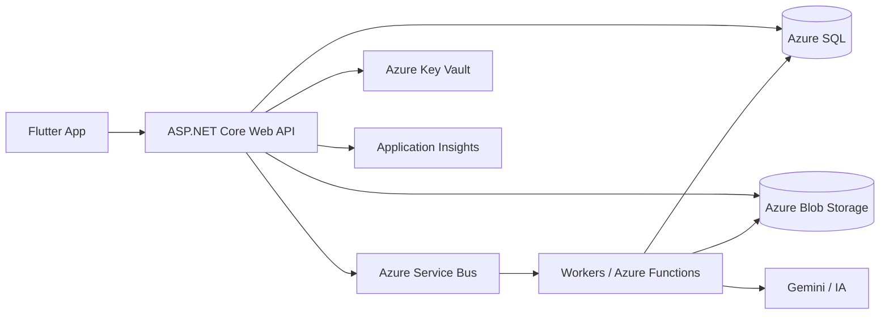
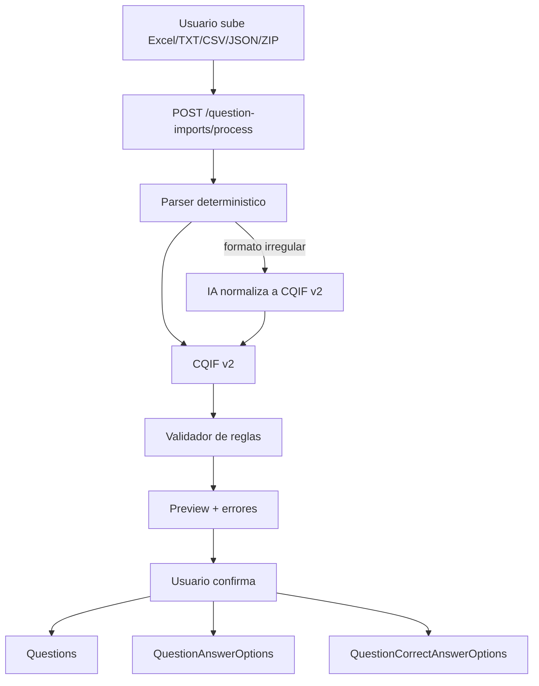
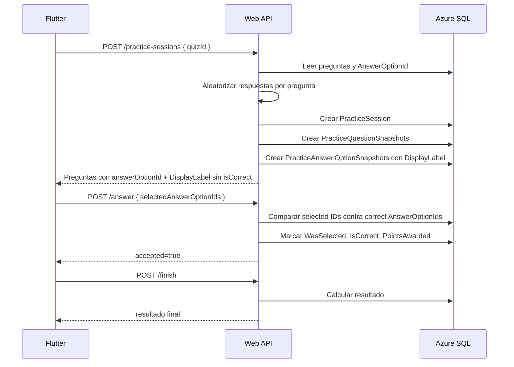
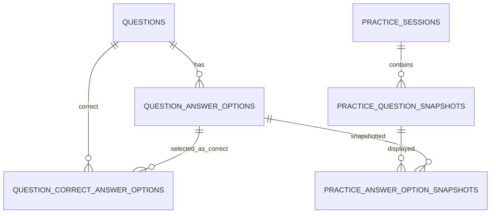

# CraftQuest 4.0 - Diagramas Mermaid

## Arquitectura general



## Importacion a CQIF v2



## Practica con respuestas aleatorias por intento



## Revision docente

```mermaid
flowchart TD
    Teacher[Profesor] --> API[GET /teacher/practice-sessions/{id}]
    API --> Auth[Validar clase/asignacion/permisos]
    Auth --> SQL[Leer snapshots historicos]
    SQL --> Review[Orden original + DisplayLabel + AnswerOptionId + WasSelected + IsCorrect]
    Review --> Teacher
```

## Modelo clave v4


