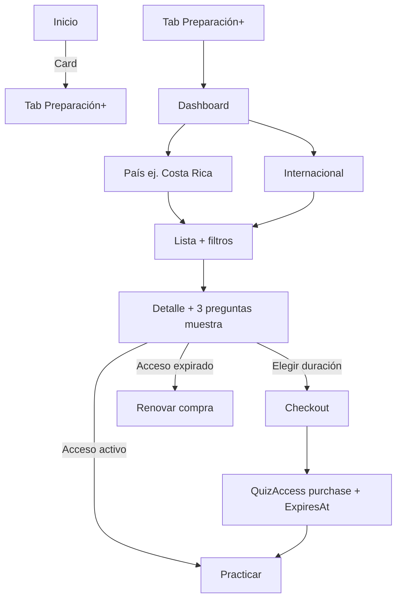

# Preparación+ — Requerimiento de producto v1

**Estado:** Aprobado por negocio · **F1–F6 implementadas**  
**Fecha:** 2026-05-25  
**Alcance:** Catálogo B2C curado + compra por duración de acceso + módulo admin (solo operador de plataforma)

---

## 1. Resumen ejecutivo

Nueva sección **Preparación+** en la app: catálogo editorial de cuestionarios organizados por **país/región** e **Internacional**, con compra de acceso por **30 / 60 / 90 días / 6 meses**, vista previa de **3 preguntas**, y gestión exclusiva mediante **módulo de administrador** (rol `content_admin` o `superadmin`).

Independiente de:
- Suscripciones Pro/Teacher (no sustituyen la compra del ítem).
- Códigos y asignaciones del profesor.

---

## 2. Decisiones cerradas

| Tema | Decisión |
|------|----------|
| **Tab (navegación)** | **Preparación+** · EN **Prep+** · PT **Preparação+** |
| **Posición en shell** | Inmediatamente **después de Inicio** |
| **Entrada en Inicio** | **Tab + card** promocional que abre la misma sección |
| **Mis accesos** | Tab Prep+ con sección activos + pestaña **Expirados** aparte |
| **Admin** | Solo desde **Perfil** (roles `content_admin` / `super_admin`) |
| **Caducidad** | **Ambas:** (A) fin de venta en catálogo; (B) acceso limitado post-compra |
| **Duraciones de acceso** | 30 días · 60 días · 90 días · 6 meses (precio distinto por cada una) |
| **Quiz expirado / sin acceso** | El ítem **permanece visible** en catálogo e historial del usuario; **no es practicable** hasta renovar compra (salvo borrado manual por admin) |
| **Precio** | **Por duración de acceso** (matriz de 4 precios por cuestionario; puede incluir opción gratis en una o todas las duraciones) |
| **Internacional** | Misma UX y filtros que país; **sin** filtro institución/examen oficial; **tags temáticos** |
| **Vista previa** | **3 preguntas** de muestra antes de comprar |
| **Operador del catálogo** | **Solo plataforma** — módulo **admin** en app/API para CRUD del catálogo |

---

## 3. Internacionalización (tab y copy)

El tab debe caber en `NavigationBar` (~12–14 caracteres máx. recomendado en móvil).

| Clave ARB sugerida | ES | EN | PT |
|-------------------|----|----|-----|
| `navPrepPlusLabel` | Preparación+ | Prep+ | Preparação+ |
| `prepPlusScreenTitle` | Preparación+ | Exam prep+ | Preparação+ |
| `prepPlusScreenSubtitle` | Cuestionarios curados para tu examen | Curated quizzes for your exam | Questionários curados para o seu exame |
| `homePrepPlusCardTitle` | Preparación+ | Prep+ | Preparação+ |
| `homePrepPlusCardSubtitle` | Compra acceso por tiempo. País, examen o tema. | Buy timed access. Country, exam, or topic. | Compre acesso por tempo. País, exame ou tema. |
| `homePrepPlusCardCta` | Explorar catálogo | Browse catalog | Explorar catálogo |

**Nota de marca:** el símbolo **+** se mantiene en los tres idiomas (identidad de producto).

---

## 4. Navegación y shell

### Orden de tabs (estudiante / usuario sin teacher)

```
Inicio → Preparación+ → Perfil
```

### Con rol teacher

```
Inicio → Preparación+ → Profesor → Perfil
```

### Implementación referencia

- Extender `MainShellPage`: insertar página `PrepPlusHubPage` en índice 1.
- Ajustar lógica `didUpdateWidget` cuando se pierde rol teacher (índices desplazados).
- Card en `HomePage`: `Navigator` o callback al shell para cambiar tab a Preparación+.

---

## 5. Taxonomía del catálogo

### 5.1 Tipos de categoría raíz

| Tipo | Código | Ejemplo | Subcategorías típicas |
|------|--------|---------|------------------------|
| Geográfica | `geographic` | Costa Rica, México | Admisión, Estandarizadas, Bachillerato, Universidad (opcional) |
| Temática | `thematic` | **Internacional** | Amor, Amistad, Aprendizaje temprano, Psicológicos, … |

### 5.2 Reglas

- Solo quizzes con `Visibility = curated` e `IsCurated = 1` (o flag dedicado `IsInPrepCatalog`) aparecen en Preparación+.
- **Internacional:** filtros = país (texto, precio, duración, tags, orden) **menos** institución / examen oficial.
- **País:** filtros adicionales opcionales: institución, tipo de examen (tags administrables).

### 5.3 Modelo de datos (nuevo esquema sugerido)

```text
catalog.PrepCategories
  - CategoryId, ParentCategoryId (null = raíz), Type (geographic|thematic)
  - Slug, SortOrder, IsActive, IconKey?, CountryCode? (ISO opcional)

catalog.PrepCatalogItems  (1 quiz publicado en catálogo)
  - CatalogItemId, QuizId (FK quiz.Quizzes)
  - CategoryId (subcategoría)
  - TitleOverride?, Description?, CoverMediaId?
  - TagsJson (array de strings)
  - InstitutionTag? (solo geographic; null en thematic)
  - ListingStartsAt?, ListingEndsAt?  (fin de venta)
  - IsPublished, PublishedAt, CreatedByUserId

catalog.PrepAccessOffers  (precios por duración)
  - OfferId, CatalogItemId
  - DurationDays (30|60|90|183)  -- 6 meses = 183 días
  - PriceAmount, CurrencyCode
  - IsFree (bit; si true, PriceAmount = 0)
  - StoreProductId? (IAP SKU por plataforma, fase 2)

catalog.PrepSampleQuestions
  - CatalogItemId, QuestionId, SortOrder  (exactamente 3 por ítem publicado)

sharing.QuizAccesses  (existente — ampliar)
  + ExpiresAt DATETIME2(7) NULL
  + GrantedByPurchaseId UNIQUEIDENTIFIER NULL FK billing.Purchases
  + AccessType ya incluye 'purchase' y 'curated'
```

**Historial:** sesiones de práctica y analítica del usuario **no se borran** cuando expira acceso; la UI muestra estado “Acceso expirado — Renovar”.

---

## 6. Experiencia de usuario (estudiante)

### 6.1 Flujo principal



### 6.2 Dashboard Preparación+

- Barra de búsqueda global.
- Sección **Por país** (grid de tarjetas).
- Sección **Internacional** (tarjeta destacada).
- Bloque **Mis accesos** (activos / por vencer / expirados).

### 6.3 Lista por categoría

**Filtros (bottom sheet “Filtros”):**

| Filtro | Geográfico | Internacional |
|--------|------------|---------------|
| Búsqueda por texto | Sí | Sí |
| Subcategoría (chips) | Sí | Sí |
| Precio: Todos / Gratis / De pago | Sí | Sí |
| Duración de acceso al comprar | Sí | Sí |
| Tags temáticos | Sí | Sí |
| Institución / examen oficial | Sí | **No** |
| Estado para mí: No comprado / Activo / Expirado | Sí | Sí |
| Idioma del quiz | Sí | Sí |
| Orden: Relevancia, Nuevos, Precio, Popularidad | Sí | Sí |

### 6.4 Detalle del cuestionario

- Metadatos: título, descripción, N preguntas, tags, subcategoría.
- **Muestra:** 3 preguntas (solo lectura; sin guardar progreso de examen).
- Selector de duración: 30 / 60 / 90 días / 6 meses con precio cada uno.
- CTA según estado:
  - Sin acceso → Comprar · {precio}
  - Acceso activo → Practicar · “Vence el {fecha}”
  - Acceso expirado → Renovar · historial visible en “Mis intentos”
  - Venta finalizada (`ListingEndsAt` pasado) → “No disponible para compra” (ítem visible si admin no lo retira)

### 6.5 Reglas de acceso

1. Tras pago verificado → `QuizAccess` con `AccessType = purchase`, `ExpiresAt = GrantedAt + DurationDays`.
2. Si `ExpiresAt < UTC now` → `HasQuizAccess` = false para práctica; listados muestran badge **Expirado**.
3. Si `ListingEndsAt` pasó → no se puede **iniciar** nueva compra; accesos ya comprados siguen hasta su `ExpiresAt`.
4. Admin **despublica** (`IsPublished = 0`) → no aparece en catálogo; usuarios con acceso activo mantienen hasta `ExpiresAt` (configurable; por defecto sí).
5. Admin **elimina** ítem del catálogo (soft delete) → oculto; historial usuario conservado en BD.

---

## 7. Pagos

- Reutilizar infraestructura `PaymentsController` / `BillingService`.
- `Purchases.ProductType`: usar `curated_package` o nuevo `prep_access` (recomendado: **`prep_access`** en CHECK constraint).
- Payload de compra: `{ catalogItemId, offerId (duration), amount, currency }`.
- Web: PayPal; móvil: IAP (SKU por offer en fase 2; MVP puede PayPal web + mock).
- Al confirmar pago: insertar `Purchase` + `QuizAccess` con `ExpiresAt`.

**Matriz de precios:** cada `PrepCatalogItem` tiene hasta **4 filas** en `PrepAccessOffers` (una por duración). Cualquier duración puede marcarse `IsFree = 1`.

---

## 8. Módulo de administrador (obligatorio v1)

### 8.1 Quién accede

- Roles existentes: **`content_admin`**, **`superadmin`** (y opcionalmente lista blanca de `UserId` en configuración).
- Estudiantes y teachers **no** ven entradas de admin del catálogo.

### 8.2 Dónde vive en la app

**Opción recomendada:** sección **“Admin Preparación+”** accesible desde **Perfil** (solo si rol admin) → hub con subpantallas. Alternativa: ícono en app bar de Preparación+ solo para admin (modo “vista operador”).

### 8.3 Funcionalidades admin (MVP)

#### A. Categorías

- CRUD árbol: raíz (país / Internacional) → subcategorías.
- Orden, activar/desactivar, icono opcional.

#### B. Ítems de catálogo

- Crear ítem: **vincular quiz existente** o flujo “crear quiz y publicar” (mínimo v1: vincular quiz ya creado por admin).
- Asignar categoría/subcategoría, tags, institución (solo geographic).
- Ventana de venta: `ListingStartsAt`, `ListingEndsAt`.
- Publicar / despublicar / eliminar (soft).

#### C. Ofertas de acceso (precios)

- Editor de 4 duraciones: 30 / 60 / 90 / 183 días.
- Precio + moneda + marcar gratis por duración.

#### D. Preguntas de muestra

- Elegir exactamente **3 preguntas** del quiz (ordenables).

#### E. Listado operativo

- Tabla/filtros: publicados, borrador, venta finalizada, sin ofertas configuradas.
- Métricas básicas: compras, accesos activos (fase 1.1).

### 8.4 API admin (prefijo sugerido)

| Método | Ruta | Descripción |
|--------|------|-------------|
| GET | `/api/admin/prep/categories` | Árbol categorías |
| POST/PUT/DELETE | `/api/admin/prep/categories/{id}` | CRUD |
| GET | `/api/admin/prep/items` | Listado con filtros |
| POST | `/api/admin/prep/items` | Crear ítem catálogo |
| PUT | `/api/admin/prep/items/{id}` | Editar metadatos / ventana |
| PUT | `/api/admin/prep/items/{id}/offers` | Matriz precios |
| PUT | `/api/admin/prep/items/{id}/samples` | 3 preguntas muestra |
| POST | `/api/admin/prep/items/{id}/publish` | Publicar |
| POST | `/api/admin/prep/items/{id}/unpublish` | Despublicar |
| DELETE | `/api/admin/prep/items/{id}` | Soft delete |

### 8.5 API pública (app estudiante)

| Método | Ruta | Descripción |
|--------|------|-------------|
| GET | `/api/prep/categories` | Raíces + hijos activos |
| GET | `/api/prep/categories/{id}/items` | Lista paginada + query filtros |
| GET | `/api/prep/items/{id}` | Detalle + offers + estado acceso usuario |
| GET | `/api/prep/items/{id}/preview` | 3 preguntas muestra |
| POST | `/api/prep/items/{id}/checkout` | Iniciar pago (offerId) |
| GET | `/api/prep/my-accesses` | Mis compras activas/expiradas |

---

## 9. Historias de usuario y criterios de aceptación

### HU-01 — Descubrir Preparación+

**Como** estudiante, **quiero** ver Preparación+ en el menú después de Inicio y una card en Inicio, **para** encontrar el catálogo fácilmente.

- [ ] Tab visible con etiqueta i18n correcta (es/en/pt).
- [ ] Card en Inicio navega al tab Preparación+.
- [ ] Orden: Inicio → Preparación+ → (Profesor) → Perfil.

### HU-02 — Explorar por país

**Como** estudiante, **quiero** entrar a Costa Rica (u otro país) y filtrar cuestionarios, **para** encontrar mi examen.

- [ ] Dashboard muestra países activos.
- [ ] Lista con filtros profesionales (sheet).
- [ ] Filtro institución solo en categorías geográficas.

### HU-03 — Explorar Internacional

**Como** estudiante, **quiero** ver temas internacionales con tags, **sin** campos de examen oficial.

- [ ] Raíz Internacional con subcategorías temáticas.
- [ ] Filtros iguales salvo institución/examen oficial.

### HU-04 — Vista previa

**Como** estudiante, **quiero** ver 3 preguntas antes de pagar, **para** evaluar el contenido.

- [ ] Detalle muestra 3 preguntas configuradas por admin.
- [ ] No inicia sesión de práctica ni consume intentos.

### HU-05 — Comprar acceso temporal

**Como** estudiante, **quiero** elegir 30/60/90 días o 6 meses y pagar, **para** practicar ese tiempo.

- [ ] Cuatro opciones con precios distintos.
- [ ] Tras pago, práctica habilitada hasta `ExpiresAt`.
- [ ] `QuizAccess.AccessType = purchase`.

### HU-06 — Acceso expirado

**Como** estudiante con acceso vencido, **quiero** ver el cuestionario y mi historial pero no practicar hasta renovar.

- [ ] Ítem visible en catálogo e “Mis accesos”.
- [ ] Botón Practicar deshabilitado / CTA Renovar.
- [ ] Historial de intentos conservado.

### HU-07 — Fin de venta

**Como** estudiante, **quiero** saber si ya no se puede comprar, **pero** seguir usando si compré antes.

- [ ] Si `ListingEndsAt` pasó: sin checkout nuevo.
- [ ] Accesos vigentes siguen hasta su `ExpiresAt`.

### HU-08 — Admin mantener catálogo

**Como** administrador de contenido, **quiero** un módulo para categorías, ítems, precios y muestras, **para** operar Preparación+ sin tocar código.

- [ ] Solo roles admin ven el módulo.
- [ ] CRUD categorías e ítems.
- [ ] Configuración 4 duraciones/precios.
- [ ] Selección de 3 preguntas muestra.
- [ ] Publicar/despublicar y ventana de venta.

---

## 10. Fases de implementación sugeridas

| Fase | Entregable |
|------|------------|
| **F1** | DDL + entidades + API admin categorías/ítems/offers/samples |
| **F2** | API pública prep + `QuizAccess.ExpiresAt` + reglas `HasQuizAccess` |
| **F3** | Flutter: tab Preparación+, dashboard, listas, detalle, preview |
| **F4** | Flutter: card Inicio + Mis accesos |
| **F5** | Pagos `prep_access` (PayPal + mock; IAP después) |
| **F6** | Flutter admin (Perfil → Admin Preparación+) |

---

## 11. Fuera de alcance v1

- Profesores publicando en Preparación+.
- Packs agrupados (varios quizzes un solo precio).
- Descuentos automáticos por plan Pro.
- Recomendaciones ML / “para ti”.

---

## 12. Referencias en código actual

| Área | Ubicación |
|------|-----------|
| Shell navegación | `mobile/.../main_shell_page.dart` |
| Inicio (card futura) | `mobile/.../home_page.dart` |
| Roles admin | `roleContentAdminLabel`, `roleSuperAdminLabel` en l10n |
| DDL acceso compra | `sharing.QuizAccesses`, `AccessType purchase`, `Quizzes.Visibility curated` |
| Pagos actuales | `PaymentsController`, `BillingService` (solo suscripción hoy) |
| `QuizAccess` sin expiry | `src/CraftQuest.Domain/Entities/QuizAccess.cs` — requiere `ExpiresAt` |

---

## 13. Implementación F1 (completada)

- Script SQL: `Documentacion/PrepPlus_Schema_F1.sql`
- Semilla opcional: `Documentacion/PrepPlus_Seed_Categories.sql`
- API admin: `AdminPrepController` → `/api/admin/prep/*` (policy `ContentAdmin`)
- Servicio: `PrepPlusAdminService`

## 14. Implementación F2 (completada)

- API pública: `PrepController` → `/api/prep/*` (usuario autenticado)
- Servicio: `PrepPlusCatalogService`
- `HasQuizAccessAsync`: ya no abre todos los `curated`; exige compra vigente (`purchase` + `ExpiresAt`)
- Checkout **gratis**: otorga acceso de inmediato; **de pago**: responde `payment_required` (F5 PayPal/IAP)

| Método | Ruta |
|--------|------|
| GET | `/api/prep/categories` |
| GET | `/api/prep/categories/{id}/items` |
| GET | `/api/prep/items/{id}` |
| GET | `/api/prep/items/{id}/preview` |
| GET | `/api/prep/my-accesses` → `{ active, expired }` |
| POST | `/api/prep/items/{id}/checkout` |

## 15. Implementación F3–F4 Flutter (completada)

- Tab **Preparación+** en `MainShellPage` (índice 1, tras Inicio)
- Card en **Inicio** → abre el tab Prep+
- Feature `lib/features/prep_plus/` (repositorio, hub, categorías, detalle, preview, mis accesos)
- Mis accesos: pestañas **Activos** / **Expirados**

## 16. Implementación F5 (completada)

- `IPrepPlusPaymentService` / `PrepPlusPaymentService`
- `ProductType = prep_access`, `ProductCode = {catalogItemId}|{offerId}`
- Endpoints:
  - `POST /api/prep/items/{id}/paypal/create-order`
  - `POST /api/prep/paypal/capture-order`
  - `POST /api/prep/mobile/verify-purchase`
- Flutter: PayPal (web/mock) + IAP consumible si `storeProductId` en la oferta
- `Payments:UseMockPayments=true` → PayPal simulado (crear + capturar en la misma sesión)

## 17. Implementación F6 Flutter admin (completada)

- Entrada en **Perfil** solo para `content_admin` / `super_admin`
- Hub: categorías + ítems del catálogo
- CRUD categorías (raíz y subcategorías)
- Listado de ítems con búsqueda y filtro publicado/borrador
- Editor de ítem: metadatos, matriz 30/60/90/183 días, 3 preguntas muestra, publicar/despublicar/eliminar
- Repositorio: `PrepPlusAdminRepository` → `/api/admin/prep/*`
- Rutas UI: `lib/features/prep_plus/presentation/admin/`
- Errores API: `PrepPlusErrorCodes` (`PREP_*`) + mapeo `ApiErrorMapper` + claves `errorPrep*` (ES/EN/PT)
