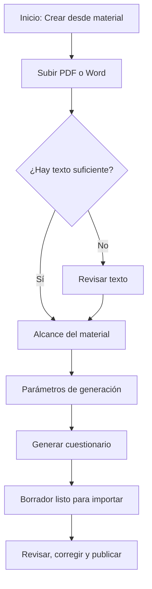

# 7. Generación con IA

Puedes subir un PDF o un Word y obtener un cuestionario en borrador. Tú revisas las preguntas antes de publicar. La generación gasta créditos de IA. En **Inicio** se ven como **~N generaciones IA · N cr.**

## Qué archivos sirven

- PDF o DOCX **con texto seleccionable**, no una foto o un escaneo.
- Tamaño máximo del archivo: **25 MB**.
- Hay un máximo de páginas por archivo. Si el documento es más largo, la propia pantalla lo dice: divídelo o exporta solo el capítulo que necesitas.
- El idioma de las preguntas sale del idioma del material, no de un selector aparte: **Las preguntas se generarán en {idioma} según el idioma del material.**

Si casi no hay texto, verás **Poco texto detectado** y tendrás que pasar por **Revisar texto**.

## Subir el material

1. En **Inicio**, entra a **Generar con IA** y toca **Crear desde material**.
2. En **Subir material**, arrastra el archivo (**Arrastra tu PDF o Word aquí**) o elige uno del dispositivo.
3. Lee **Consejos y límites de formato**.
4. Cuando aparezca **Archivo listo para subir**, toca **Subir y analizar**. Puedes **Cambiar archivo** o **Quitar** antes de enviarlo.
5. Espera **Analizando documento…**

Los materiales quedan en **Biblioteca de materiales**. Se eliminan solos a los días que indica la biblioteca (**Los materiales se eliminan solos a los N días**). Puedes borrarlos antes con el icono de papelera. Cada ficha muestra **Listo**, **Procesando**, **Pendiente** o **Error**, y **Revisar texto** si hace falta.

## Si hay que revisar el texto

**Revisar texto** aparece cuando el documento tiene poco texto extraíble. Corrige lo detectado o pega el contenido y toca **Guardar y continuar**.

## Alcance y parámetros

**Alcance del material** indica de cuántas palabras saldrán las preguntas (**N palabras en el documento**). Puedes escribir un **Enfoque opcional (tema o apartado)** para acotar. Un documento extenso puede mostrar **Documento extenso: +N créditos**.

En **Parámetros de generación**:

1. Elige un preset o ajusta a mano: **Repaso rápido**, **Examen estándar** o **Práctica profunda**.
2. Fija el **Número de preguntas**. Verás el recomendado y el máximo: **Recomendado: N · Máximo: N**.
3. Marca los **Tipos de pregunta**: **Opción única**, **Opción múltiple** y **Verdadero / falso**.
4. Elige la **Dificultad**: **Fácil**, **Media**, **Difícil** o **Mixta**.
5. Activa **Incluir justificaciones** si quieres explicación y, cuando aplique, el número de página del material. Esa justificación se ve al revisar el intento, no durante la práctica.
6. Comprueba el coste: **Consumirá N créditos IA (N disponibles)**.
7. Toca **Generar cuestionario**.

## Mientras se genera

**Generando cuestionario** muestra **La IA está creando preguntas a partir de tu material…** Puedes salir de esa pantalla. Cuando termine, llega una notificación **Cuestionario IA listo**. Si falla: **Error en cuestionario IA**.

## Usar el borrador

El cuestionario de destino muestra **Importar preguntas generadas por IA** y un aviso del estilo **N preguntas generadas por IA listas para importar**. En la lista puede aparecer **Borrador IA listo para importar**.

1. Abre el cuestionario y toca **Importar preguntas generadas por IA**.
2. Revisa la vista previa igual que en una importación.
3. Confirma, corrige enunciados o respuestas que no tengan sentido y solo entonces toca **Publicar**.

> **Aviso.** La IA se equivoca. No publiques sin leer al menos las respuestas correctas. Una justificación no garantiza que la opción marcada sea la buena.

## Si no hay créditos

La app ofrece comprar un paquete: **Puedes comprar un paquete de créditos para seguir generando con IA.** En el plan **Gratis** el mensaje es **Mejora a Pro o Tutor para comprar paquetes de créditos IA.** Los paquetes se explican en Planes y pagos.

El cupo mensual del plan se reinicia cada mes. Los créditos comprados en paquete no caducan.
