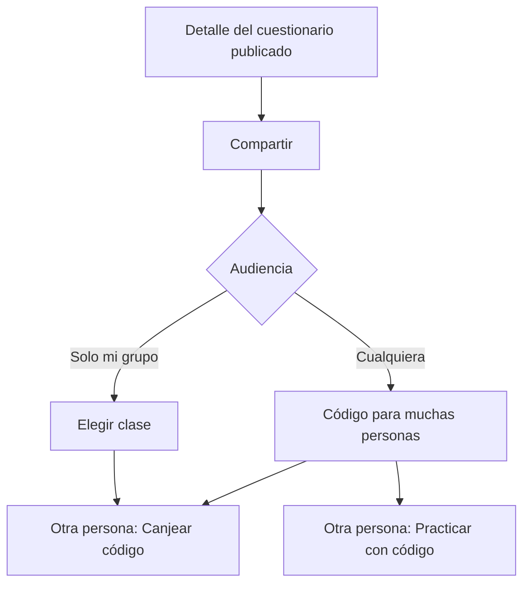

# 9. Compartir

Un cuestionario publicado se comparte con un código. Quien lo recibe lo practica sin ver los intentos de los demás.

## Crear el código

1. Publica el cuestionario si sigue en **Borrador**.
2. En el detalle, toca **Compartir**.
3. Elige la audiencia.
   - Si no eres tutor, el subtítulo es **Se generará un código para que muchas personas practiquen (sin ver intentos ajenos).** No verás la opción de grupo.
   - Si eres tutor: **Elige si cualquiera puede practicar o solo tu grupo.**
4. **Cualquiera**: con o sin cuenta. El mismo código vale para todos. El resultado dice **Válido para muchas personas. También sirve en «Practicar con código» sin cuenta.**
5. **Solo mi grupo**: elige la **Clase**. Solo estudiantes de esa clase, con cuenta. Si no tienes clases: **Aún no tienes clases. Crea una clase para compartir solo con tu grupo.**
6. Copia con **Copiar** (**Código copiado**) o envía el mensaje con **Copiar para compartir** o **Compartir link**. El mensaje incluye el enlace y el código: **Únete a "{título}" en CraftQuestAI**.
7. Cierra con **Cerrar**.

El código es permanente. Más adelante, **Ver código** lo muestra otra vez: **Este es el código permanente de este cuestionario.**

## Canjear un código (con cuenta)

1. Inicia sesión.
2. En **Inicio**, toca **Canjear código**.
3. En **Canjear código de acceso**, escribe el **Código**. El subtítulo dice **Introduce el código compartido por tu tutor o compañero**.
4. Confirma. Si sale bien: **Acceso concedido a "{título}"** y la app abre el cuestionario.
5. Practica desde ahí o desde **Cuestionarios compartidos**.

Si ya lo tenías: **Ya tienes «{título}» en Mis compartidos.** Un código de **Solo mi grupo** falla si no perteneces a esa clase.

Sin cuenta, no uses esta pantalla: usa **Practicar con código** en el inicio de sesión (capítulo Modo invitado).

## Cuestionarios compartidos

**Inicio** → **Cuestionarios compartidos**. Cada grupo indica quién lo compartió (**Compartido por {nombre}**) y cuántos hay.

Si la lista está vacía: **No tienes cuestionarios compartidos. Canjea un código.**

Puedes quitar uno de tu lista con **Quitar de compartidos**. **¿Quitar de compartidos?** aclara que el cuestionario no se borra: puedes volver a canjearlo con el código. Tras confirmar: **Cuestionario quitado de compartidos**.

El plan puede limitar cuántos compartidos guardas. La franja lo muestra como **Cuestionarios compartidos: actual/máximo**.

> **Consejo.** Para probar el código tú mismo, ábrelo en una ventana de incógnito con **Practicar con código**, o en otra cuenta con **Canjear código**. No hace falta un segundo teléfono.
