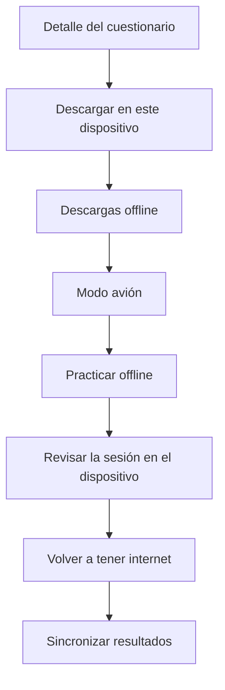

# 10. Práctica sin conexión

Esta función está en el teléfono (Android o iOS), no en la web. Sirve para descargar un cuestionario publicado y responderlo sin internet. Al volver la red, los resultados se sincronizan.

Hace falta un plan de pago. En el plan **Gratis**, el detalle indica **Descarga este cuestionario en tu dispositivo con un plan de pago** y el botón **Ver planes**.

## Descargar

1. Con conexión, abre un cuestionario publicado que ya tenga preguntas.
2. Toca **Descargar en este dispositivo**. Mientras trabaja: **Descargando…**
3. Cuando termine, el cuestionario queda **Disponible sin conexión en este dispositivo**.

Si el cuestionario cambió en el servidor, usa **Actualizar** (**Actualizando…**) para traer la versión nueva al teléfono.

Las preguntas con imagen muestran cuántos archivos de media están listos, en el resumen **N preguntas · tamaño · Media listos/total**. Espera a que la media termine antes de quedarte sin red.

## Practicar sin red

1. Activa el modo avión o apaga los datos.
2. En **Inicio**, toca **Descargas offline**, o desde el detalle **Practicar offline**.
3. Elige el cuestionario y responde la sesión.
4. Al terminar, revisa el resultado en el dispositivo. Esa revisión vive en el teléfono hasta que sincronices.

Si no hay descargas: **Sin descargas offline. Descarga cuestionarios desde el detalle del quiz (plan pago).**

> **Nota.** Sin red no se crean cuestionarios, no se genera con IA y no se canjean códigos. Solo se practica lo ya descargado.

## Sincronizar y borrar

1. Vuelve a tener internet.
2. En **Descargas offline**, usa **Sincronizar resultados** para enviar los intentos hechos sin conexión.
3. Para liberar espacio, **Eliminar descarga** o **Eliminar**. El diálogo dice **Se eliminará este cuestionario de tu dispositivo. Podrás volver a descargarlo cuando tengas conexión.** Tras confirmar: **Descarga offline eliminada.**

Borrar la descarga no borra el cuestionario de tu cuenta ni los intentos que ya se sincronizaron.
