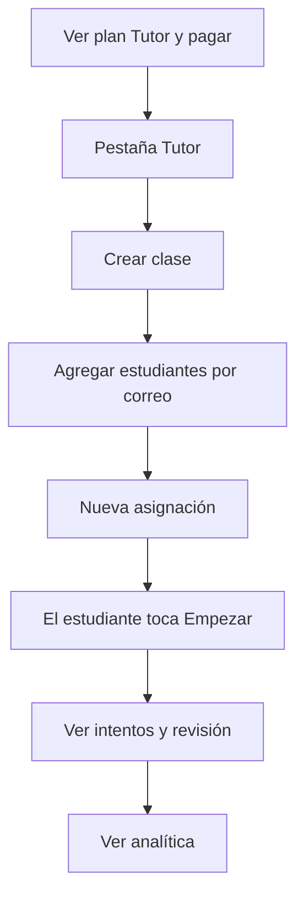

# 13. Tutor

El aula está en la pestaña **Tutor**. Hace falta el plan **Tutor**. Sin él, la pestaña no existe.

## Activar el plan

1. En **Inicio**, el aviso **¿Eres tutor?** dice **Clases, asignaciones y analítica en tiempo real.** Toca **Ver plan Tutor**. Puedes ocultarlo una semana o un mes; el tooltip es **Ocultar esta semana** u **Ocultar este mes**.
2. La página se presenta como **Convierte tus quizzes en un aula**. Toca **Hazte Tutor**.
3. Completa el pago (mensual; **Cancela cuando quieras · Acceso inmediato al pagar**).
4. Al volver, la barra inferior muestra **Tutor**. Si ya lo tienes: **Ya tienes un plan Tutor activo** y la **Próxima renovación**.

Para dejar de renovar: **¿Cancelar suscripción?** y **Desactivar renovación**. Mantienes el plan hasta el final del periodo pagado y después pasas a **Gratis**. **No, mantener** cierra el diálogo sin cambios.

> **Nota.** Cancelar la suscripción en la tienda o en PayPal es distinto de borrar la cuenta. Si solo desactivas la renovación, sigues entrando hasta la fecha indicada.

## Panel y clases

Dentro de **Tutor** hay dos destinos propios: **Panel** y **Mis clases**.

**Panel** resume **Estudiantes**, **Clases**, **Quizzes** y la actividad de **Esta semana** (**Alumnos activos esta semana**). **Actividad reciente** empieza vacía: **Aún sin actividad. ¡Comparte un quiz con tus estudiantes!** **Requiere atención** lista tareas que vencen o tienen entregas pendientes (**N de N sin entregar**, **Vence {fecha}**). Si no hay urgencias: **No hay tareas urgentes por ahora.**

## Crear una clase

1. En **Mis clases**, toca **Crear clase**. Si no hay ninguna: **Aún no has creado ninguna clase.**
2. Escribe el **Nombre de la clase** (el ejemplo de la app es **Ej. Álgebra II — Período 3**) y, si quieres, la **Descripción (opcional)**.
3. Toca **Guardar**.

En el detalle hay tres pestañas: **Miembros**, **Asignaciones** y **Analítica**.

### Miembros

1. Toca **Agregar estudiante**.
2. Escribe el **Correo del estudiante**. Tiene que ser una cuenta ya registrada. Si no existe: **No hay ningún estudiante registrado con ese correo.** Si ya está: **Ese estudiante ya pertenece a esta clase.**
3. Toca **Agregar**.

El estudiante recibe el aviso **Te unieron a una clase**. Si la alta queda pendiente, la verás en **Pendientes de aprobación** y podrás **Aprobar**.

**Eliminar** a un miembro pide confirmación: **Este estudiante perderá acceso a todas las asignaciones de esta clase.**

Si no hay nadie: **Aún no hay estudiantes en esta clase.**

### Archivar

**Archivar clase** abre **¿Archivar clase?** **Los estudiantes ya no verán las asignaciones de esta clase.** Confirma con **Archivar**. La clase pasa a **Clases archivadas**. Puedes **Restaurar clase**. Una clase archivada muestra **Esta clase está archivada. Restáurala para editarla o asignar tareas.**

**Eliminar** solo está disponible si ya está archivada (**Archiva la clase antes de eliminarla**). Quita la clase de tu lista; el mensaje aclara que los datos se conservan en el sistema.

## Crear una asignación

1. En la clase, pestaña **Asignaciones**, crea **Nueva asignación**.
2. **Título** (ejemplo de la app: **Ej. Capítulo 5 — Quiz de práctica**).
3. **Instrucciones (opcional)**.
4. **Seleccionar quiz**. Tiene que estar publicado.
5. **Se abre el** y **Fecha límite**.
6. **Intentos máximos**. En blanco significa ilimitados.
7. **Mostrar respuestas correctas**:
   - **Nunca**
   - **Tras cada intento**
   - **Tras la fecha límite**
   - **Solo el tutor**
8. **Orden aleatorio de preguntas** y, si quieres, **El alumno puede cambiar el orden**. Si lo desactivas, todos usan la opción de arriba.
9. **Salir sin terminar consume un intento** solo se puede activar si hay al menos un intento máximo. **Define al menos 1 intento máximo para activar esta regla.** El alumno no podrá pausar y reanudar.
10. Guarda.

Los estudiantes la ven en **Asignaciones de clase** y pueden recibir **Nueva tarea**.

Compartir el cuestionario con **Solo mi grupo** (capítulo Compartir) es otro camino: da acceso al quiz, pero no crea fechas ni intentos máximos. Para una tarea con fecha límite usa **Nueva asignación**.

## Revisar intentos

1. Abre la asignación y toca **Ver intentos**. El título es **Intentos de práctica**.
2. Filtra por **Estudiante** o deja **Todos los estudiantes**.
3. El resumen dice **N estudiantes · N intentos**. Puedes ordenar con **Orden predeterminado** o **Mejor nota primero**.
4. Abre un intento. **Revisión del intento** muestra la puntuación y cada pregunta.
5. La leyenda es **Rojo = respuesta marcada incorrecta · Verde = respuesta marcada correcta · Bombilla = respuesta correcta no marcada**.
6. Filtra **Todas** o **Solo falladas**.

Si nadie ha terminado: **Aún no hay intentos finalizados**.

La justificación de cada pregunta, si la escribiste o la generó la IA, se ve en esta revisión.

## Analítica de la tarea y de la clase

**Ver analítica** abre **Analítica de la tarea**:

- **Alumnos**, con **Sin intento**, **Mejor** y **Último**.
- **Entregaron N de N**.
- **Preguntas difíciles**, con el porcentaje de error.
- **Selección por opción (esta tarea)**.
- **Distribución de notas**.

En la clase, la pestaña **Analítica** muestra **Alumnos con práctica**, el **Promedio** y las **Asignaciones**.

> **Consejo.** Si **Requiere atención** marca una tarea con muchos **sin entregar**, abre la analítica antes de cambiar las preguntas: a veces el problema es la fecha, no el enunciado.
